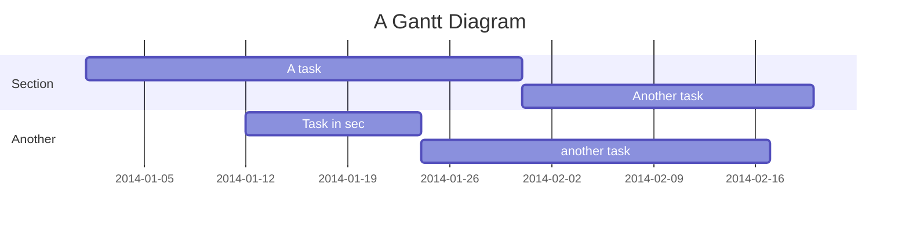
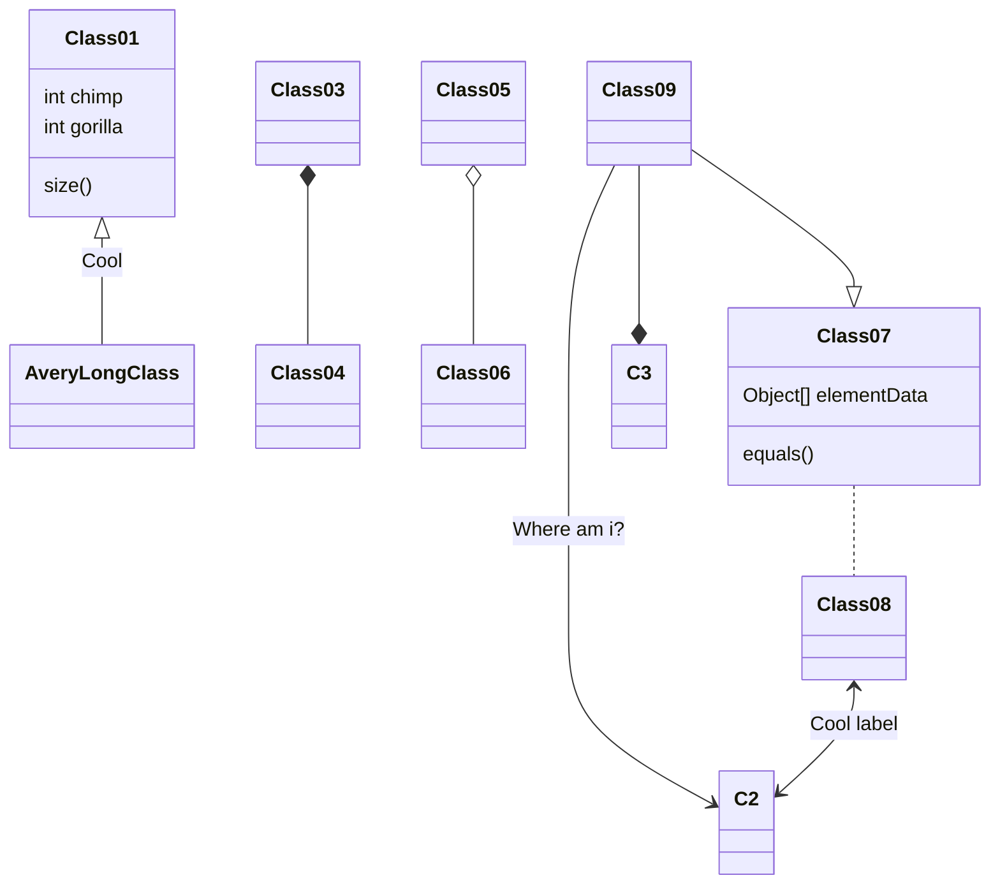

<meta author="Sascha" />

# Contributors guide
This wiki is completely open source and avaliable on github. Only with your help we are able to maintain a correct and updated version of all the functions in here. Please contribute! Suggestions are always appreciated and should be sent to sascha8a@localhost.systems
* Finish documentation for incomplete functions.
* Add examples to functions and events.
* Review and verify pages that need checking.
* Write tutorials to help new people.

## Todos
There are a lot of //TODOs scattered all around the wiki, just look around and you'll notice. We invite you to contribute and fix every single one.

!> **TODO: ** This is an example!

## Diagramms
We use the [Mermaid Framework](https://github.com/knsv/mermaid) for any diagrams.

